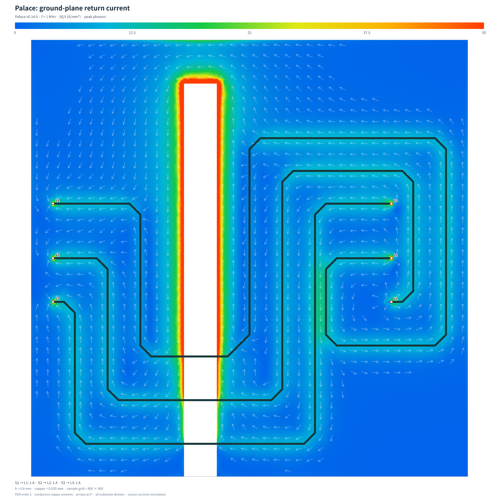
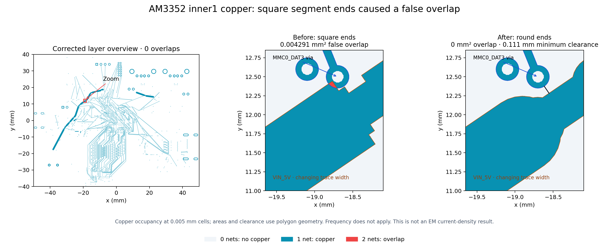

# simulate-return-current

Generate return-current SVG/PNG images from **tscircuit circuit-json** with
**Palace EM**. Select the signal's source/load pins, ground net, peak current and
frequency explicitly.



## CLI

Requires **Node.js 20.11+**. Before the first npm release, run from a checkout:

```sh
bun install
bun run build
node dist/cli.js --help
```

Use `node dist/cli.js` in place of `simulate-return-current` in the examples
below. Once published, install globally or run with `npx`:

```sh
npm install -g simulate-return-current
simulate-return-current --help
# Or: npx simulate-return-current --help
```

For Palace, also install **Python 3.12** and run Docker, or provide native
**Palace v0.14.0** with `--palace-bin /path/to/palace`. Install the Python
dependencies into a local environment using the bundled setup command:

```sh
simulate-return-current setup --python python3
```

This creates `.return-current-python/` in the current directory, which subsequent
runs detect automatically. On Debian/Ubuntu, Gmsh needs `libglu1-mesa` too.
Use `--python /path/to/venv/bin/python` or `PALACE_PYTHON` for an existing
environment. The Docker fallback is a community-built image pinned by digest.

### Use your circuit-json

Export the circuit-json array from your tscircuit board with
`circuit.getCircuitJson()` after `await circuit.renderUntilSettled()`. Save that
array as `board.json`; traces, vias and reference copper must already be
rendered. Inspect available pin names and aliases:

```sh
simulate-return-current ports board.json
```

Run a **1 MHz**, **100 mA peak** excitation from `R1.pin1` to `U1.VDDIO1`, referenced
to the bottom copper on `GND`:

```sh
simulate-return-current board.json \
  --source R1.pin1 --load U1.VDDIO1 --ground GND \
  --current 0.1A --frequency-hz 1000000 \
  --output return-current --cell-size 0.05 --image-size 2000
```

Open `return-current/palace.png` or `palace.svg`. The case also saves the resolved
`excitation-ports.json`, input circuit, model, mesh, solver logs, raw ParaView
fields, complex sampled currents and `run-timing.json`.

### Circuit JSON definitions and results (PR887)

Named flags now create official `simulation_experiment` (`pcb_return_current`)
and `simulation_return_current_excitation` elements. Completed runs write the
full board plus official result, field, heatmap and marker records to
`return-current/circuit-result.json`, or the path given by `--result-json`:

```sh
simulate-return-current board.json \
  --source U1.OUT --source-reference U1.GND \
  --load U2.IN --load-reference U2.GND \
  --ground GND --current 5mA --frequency-hz 1000000 \
  --source-impedance 25 --load-impedance 100 \
  --experiment-id simulation_experiment_example \
  --experiment-name "U1 to U2 return path" \
  --result-json results.circuit.json --output example

# Or run an existing pending definition, without redefining its terminals:
simulate-return-current pending.circuit.json \
  --experiment-id simulation_experiment_example --frequency-hz 1000000 \
  --result-json results.circuit.json --output example
```

If exactly one PCB return-current experiment exists, `--experiment-id` can be
omitted. With multiple experiments it is required. Named flags create a new
experiment; supplying an ID already present in the board is rejected. Results
from other experiments/frequencies are preserved. Rerunning replaces the selected
experiment's results at that frequency and their associated fields, heatmaps and
markers. `--result-id` sets an explicit result ID; collision with another result
is rejected. Frequency-independent approximation results form a separate slot.

PR887 does not define frequency, solver, or fabrication stackup on a pending PCB
return-current experiment. These remain explicit run options:
`--frequency-hz` is required for Palace, and multilayer Palace requires
`--stackup-file`. The optional result `frequency_hz` records the frequency actually
solved. `--solver approximation` emits a **real**, frequency-independent field
and omits `frequency_hz`; it cannot accept a frequency or explicit reference pins.
`--prepare-only` saves definitions/model inputs without result elements or a solve.
No renderer output or approximation is relabeled as EM evidence.

Fields are row-major from the **bottom-left**, in **A/mm** sheet current. Palace
fields contain real/imaginary peak phasor channels using `exp(+jωt)`; missing
conductor cells are `null` in every channel, and valid zero-current copper is
zero. Copper thickness and grid geometry are millimetres. Heatmaps are field-only
transparent PNGs, with top-left pixel at `(min_x, max_y)`; their linear scale uses
the maximum vector magnitude divided by copper thickness (A/mm²) for that run.
For absolute comparisons, render from the field using a common fixed density
scale rather than comparing independently scaled PNG colors.

Assets are embedded data URLs so moving the result file preserves the numerical
field and image. `--field-format gzip` (default) uses `application/gzip`;
`--field-format json` embeds plain `application/json`. `project_relative_path`
provides a suggested export filename, and decoding is selected by MIME type.
The exporter validates decoded channels against the official grid schema and
checks model/current/contact/provenance consistency before writing any results.
Markers only identify actual PCB ports or vias. An omitted named reference
becomes an identified copper-pour contact beneath the signal, never a fabricated
GND pad. Missing or wrong-net contacts and unrepresentable via contacts are rejected.

Library exports are `createReturnCurrentExperiment`,
`selectReturnCurrentExperiment` and `exportReturnCurrentCircuitJson`.
The definition/selection helpers are available from the browser-compatible main
entry. The Node exporter is imported from `simulate-return-current/circuit-json`,
which also exports both helpers; gzip and native PNG rendering stay out of browser
bundles.
`selectReturnCurrentExperiment` also returns `solverCircuitJson`, which orients
selected routes driver → load without changing the output board's route order.
Pass the selected `excitations` to the chosen solver, then supply either its
`SimulationResult` or `{model, reference}` from the completed Palace run to the
exporter. Input display-offset numbers are normalized to strings by the parser;
unknown board metadata is preserved. Legacy point-only excitation inputs remain
accepted by the old APIs and `--use-circuit-excitations`; official result output
requires an identified PR887 experiment/contact definition.

**Frequency comes from `--frequency-hz`, not from circuit-json or the pin name.**
`--source` names the driver terminal; `--load` names the receiving terminal.
`--current` is the signed peak current at that frequency, not RMS. Named pins
resolve through source components/ports to PCB ports and the connecting trace;
you do not need to look up `pcb_trace_id` or manually inject excitation records.

### Choose both terminals of each port

A port is a **pair of terminals**: the signal pin and its reference pin. The
source port drives the PCB; the load port terminates it. To model a source
between `U1.OUT` and `U1.GND`, and a load between `U2.IN` and `U2.GND`:

```sh
simulate-return-current board.json \
  --source U1.OUT --source-reference U1.GND \
  --load U2.IN --load-reference U2.GND \
  --ground GND --current 5mA --frequency-hz 1000000 \
  --source-impedance 25ohm --load-impedance 100ohm \
  --output explicit-ports
```

This imposes a **5 mA peak sinusoidal source current at 1 MHz**, with a 25 Ω
source-port resistance and a 100 Ω load resistance. The source current is
`I(t) = 0.005 cos(2π × 1000000 × t)` A. The receiving component's actual
impedance is not inferred from its pin name or component properties.

| Input | Meaning / default |
| --- | --- |
| `--source`, `--load` | Required signal pins: `refdes.pin`, pin name or alias |
| `--source-reference`, `--load-reference` | Optional named ground pins; omitted endpoints reference bottom copper directly beneath the signal |
| `--ground` | Common ground net name or `source_net_id`; selecting a net does not create copper |
| `--current` | Signed peak current; bare numbers are amperes |
| `--frequency-hz` | Required single frequency in Hz; no implicit frequency |
| `--source-impedance`, `--load-impedance` | Positive **real resistance**, independently defaulting to 50 Ω |

Palace applies these resistances to its two-terminal lumped ports. The source
port includes an impressed Norton source and a parallel resistance; the importer
normalizes the **net injected source current**, after subtracting the
termination current, to the requested amplitude. The load current and voltage
are solved quantities; they are not separately forced. The current source is
prescribed externally: this does not simulate an IC, resistor or power supply
as a SPICE circuit, or specify an independent source voltage.

**Reference geometry matters.** In the legacy two-layer model, a named bottom-layer reference must lie on the
selected ground copper. A named top-layer reference must be a rectangular SMT
ground pad with a **concentric top-to-bottom ground via already in circuit-json**.
The tool meshes the pad, drilled hole and copper barrel, and places the lumped
port across the gap from signal pad to ground pad. It does not silently connect
a floating pad to the plane. Other ground-via arrangements need future routing
support. Both reference pins must be connected to `GND` in source connectivity;
labels such as `GND` alone are insufficient.

The [complete TSX example](tests/fixtures/ExplicitPortBoard.tsx) emits two signal
pins, two ground pads, both vias, and the bottom pour through tscircuit/core.
For its `U1.GND` pad at board coordinates `(-2, 1.5)`, the connection includes:

```tsx
<trace from=".U1 > .GND" to="net.GND" />
<via
  name="GV1" pcbX={-2} pcbY={1.5}
  fromLayer="top" toLayer="bottom"
  holeDiameter="0.2mm" outerDiameter="0.6mm"
  connectsTo="net.GND"
/>
```

### Current and resistance units

The [completed Palace example](examples/palace/explicit-ports-1mhz) includes a
TSX-derived visual snapshot, resolved ports, solver evidence and timing: its
5 mA / 1 MHz case at 0.05 mm sampling took 56.64 seconds including mesh, solve
and export. Image markers use `S1+`/`S1−` and `L1+`/`L1−` for the two terminal
pairs; `+`/`−` denote port polarity. CLI images currently use a fixed 50 A/mm²
color-scale maximum; for small currents, the library renderer can set
`maxCurrentDensity` to a suitable shared scale, as this example does.

Currents accept numbers or strings in both the CLI and library:

| Example | Peak amperes |
| --- | ---: |
| `5mA` | 0.005 |
| `0.1A` or `0.1` | 0.1 |
| `250uA`, `250µA`, `250μA` | 0.00025 |
| `10nA` | 0.00000001 |
| `-5mA` | -0.005 (180° phase reversal) |
| `1e-3A` | 0.001 |

Spaces are accepted when quoted, e.g. `--current "5 mA"`. Units are
case-sensitive (`mA` is supported; `MA` is not). Values are **peak, not RMS**.
For a sine specified in RMS, supply `√2 × RMS` as the peak value. Resistance
accepts bare ohms, `50ohm`, `50Ω`, `1kohm`, `1kOhm`, `1kΩ`, `1MOhm`, etc.
Zero, negative, infinite and complex impedances such as `50+j10` are rejected.
Ideal shorts/opens and reactive RLC terminations are not implemented.

### Multiple simultaneous signals

Repeat `--excitation source,load,current` for the default reference contacts.
They share the specified frequency and ground net, with signed, in-phase peak
currents. Source/load impedance flags apply to each excitation:

```sh
simulate-return-current board.json --ground GND --frequency-hz 1000000 \
  --excitation U1.OUT1,U2.IN1,5mA \
  --excitation U1.OUT2,U2.IN2,0.1A \
  --source-impedance 25 --load-impedance 100 --output two-signals
```

To name both terminals, use the five-field form
`source,sourceReference,load,loadReference,current`:

```sh
simulate-return-current board.json --ground GND --frequency-hz 1000000 \
  --excitation U1.OUT1,U1.GND,U2.IN1,U2.GND,5mA \
  --excitation U1.OUT2,U1.GND,U2.IN2,U2.GND,-5mA \
  --output opposing-signals
```

The negative current gives the second excitation a 180° phase reversal. The EM
fields are combined as complex vectors **before** calculating the heatmap's
magnitude. Opposing signals can represent differential drive, but both ports
still terminate to ground; a true resistor directly between P and N is not
supported. Other phase angles and different frequencies in one solve are not
supported.

For per-signal resistances, put an **array** in `ports.json`:

```json
[
  {
    "source": "U1.OUT1", "sourceReference": "U1.GND",
    "load": "U2.IN1", "loadReference": "U2.GND",
    "current": "5mA", "sourceImpedance": "25ohm", "loadImpedance": 100
  },
  {
    "source": "U1.OUT2", "sourceReference": "U1.GND",
    "load": "U2.IN2", "loadReference": "U2.GND",
    "current": "-0.1A", "sourceImpedance": 50, "loadImpedance": "1kohm"
  }
]
```

```sh
simulate-return-current board.json --ports-file ports.json \
  --ground GND --frequency-hz 1000000 --output multi-port
```

Use exactly one input style: single-source flags, repeated `--excitation`, or
`--ports-file`. Reference pins go inside each repeated excitation; do not combine
it with single-source reference flags. Each source/load pair still needs one
continuous PCB trace, including physical via transitions when a stackup is supplied. Shared ground reference pads are allowed, provided
port apertures do not overlap or intersect unrelated copper.

### Frequency and geometry comparisons

Run independent cases to compare frequencies or load resistances:

```sh
for hz in 500000 1000000 2000000; do
  simulate-return-current board.json \
    --source U1.OUT --load U2.IN --ground GND --current 5mA \
    --frequency-hz "$hz" --output "result-$hz"
done
```

Changing frequency, terminals, termination resistance, geometry or FEM mesh
requires a new solve. A digital waveform needs separate harmonic amplitudes and
phases; waveform reconstruction is not implemented. To compare slot shapes,
export separate circuit-json files and use the same excitation and numerical
settings for each.

Use `--prepare-only` to inspect the resolved ports, model and sample grid before
running an EM solve. `excitation-ports.json` records currents in amperes,
resolved terminal coordinates/layers and resistances; inspect `model.json` too.
For JSON that already contains
`simulation_return_current_excitation` records, explicitly use
`--use-circuit-excitations` with `--frequency-hz` instead of naming pins.

### Resolution and resampling

`--cell-size` sets image sample spacing in mm (Palace default 0.2). On a 40 mm
square board, 0.05 mm gives **800 × 800** sample cells. `--image-size` sets square
SVG/PNG dimensions in pixels (default 1100).

To resample a completed case without rerunning Palace:

```sh
simulate-return-current resample return-current --cell-size 0.05 --image-size 2000
```

Keep the case's raw `postpro/` fields. Resampling overwrites its sampled reference
and images and writes `resample-timing.json`. It evaluates the saved FEM fields
at new positions; **image sampling does not refine the EM mesh**. Change
`--mesh-size` (default 2 mm), `--order` (default 2), or `--air-padding` (default
6 mm) and start a new solve to change the numerical model. Frequency and geometry
changes also need a new solve. Use `--processes` for MPI parallelism.

Colors show the complex magnitude of thickness-averaged conduction-current
density in A/mm²; arrows show the instantaneous field at phase 0°. Palace sample
grids allow up to 1,000,000 candidate cells. The included
[0.05 mm example](examples/palace/ground-slot-wide-gap-005mm-1mhz) records export
timings and the original solve's provenance.

### Quick approximation

For a preview without Python or Docker, select the TypeScript approximation:

```sh
simulate-return-current board.json --solver approximation \
  --source R1.pin1 --load U1.VDDIO1 --ground GND --current 1 \
  --cell-size 0.5 --output preview
```

Open `preview/approximation.png`. This model is **frequency-independent**;
`--frequency-hz` is rejected for it. Its grid is limited to 100,000 candidate
cells. Use Palace for the frequency-dependent simulation.

## Multilayer boards

Provide the manufacturing stack **top to bottom**, alternating copper and
physical dielectric layers. Thicknesses are millimetres; dielectric constants
are relative permittivities. Each dielectric can specify `lossTangent`
(default 0.02). For example, `stackup.json`:

```json
{
  "nominalBoardThicknessMm": 0.975,
  "layers": [
    { "name": "top", "copperThicknessMm": 0.035 },
    { "material": "prepreg", "dielectricThicknessMm": 0.2, "dielectricConstant": 4.1 },
    { "name": "inner1", "copperThicknessMm": 0.015 },
    { "material": "core", "dielectricThicknessMm": 0.475, "dielectricConstant": 4.42 },
    { "name": "inner2", "copperThicknessMm": 0.015 },
    { "material": "prepreg", "dielectricThicknessMm": 0.2, "dielectricConstant": 4.1 },
    { "name": "bottom", "copperThicknessMm": 0.035 }
  ]
}
```

```sh
simulate-return-current board.json --stackup-file stackup.json \
  --source U1.OUT --source-reference U1.GND \
  --load U2.IN --load-reference U2.GND \
  --ground GND --sample-layer inner2 --current 5mA --frequency-hz 1000000 \
  --cell-size 0.05 --output inner2-return
```

`--sample-layer` selects the reference-net foil whose complex conduction
current is integrated through its thickness and plotted. It defaults to
`bottom` and is displayed on multilayer snapshots. It does **not** constrain
where current flows: Palace solves the full emitted conductor geometry. Omitted
reference pins connect the port to reference copper on the sampled layer
beneath its signal endpoint. Explicit reference pins can be on another layer,
but must have real traces/vias connecting them to the sampled reference copper.

Save a separate case for each sampled layer. `resample` changes the XY pitch
within the saved layer, reusing its solve. Sampling pitch is independent of FEM
mesh size; 0.05 mm pixels alone do not establish mesh convergence. Stackup
coordinates use the upper face of bottom copper as z=0. Explicit thicknesses
are never scaled to `pcb_board.thickness` or nominal fabrication thickness.
`model-audit.json` reports geometry counts and modeling assumptions.

The [four-layer TSX fixture](tests/fixtures/MultilayerBoard.tsx) routes from top
through blind signal vias onto `inner1`, with ground on `inner2` and bottom
connected by through vias. Its recorded [1 MHz Palace case](examples/palace/multilayer-inner2-1mhz)
uses 5 mA, 25 Ω/100 Ω terminals, and an inner-layer visual snapshot. Tests also
cover six-layer boards and bottom signal terminals.

### AM3352 SBC

The [astra/am3352-sbc board](https://tscircuit.com/astra/am3352-sbc#files), pinned
to **0.1.19**, emits a four-layer, 100 × 80 mm board: 750 PCB traces, 835 vias,
1,056 SMT pads, 46 plated holes, eight unplated holes and 27 pours. Its stackup is
in `design/fabrication-stackup.json`, separate from `dist/index/circuit.json`.

From a checkout, download the pinned public files, verify their SHA-256 hashes
and prepare the full model (no EM solve):

```sh
bun scripts/prepare-am3352-example.ts work/am3352
# The equivalent CLI preparation, after downloading:
node dist/cli.js work/am3352/board.json \
  --stackup-file work/am3352/stackup.json --sample-layer bottom \
  --source U1.K4 --load U3.A7 --ground GND --current 5mA \
  --frequency-hz 1000000 --cell-size 0.2 --prepare-only \
  --output work/am3352/case
```

`U1.K4 → U3.A7` is `DDR_D12`, used here to exercise input/routing at an explicitly
chosen **1 MHz**, not to represent its actual DDR waveform. Choose your actual
ports, harmonics and amplitudes for an analysis. The explicit stack sums to
**1.5642 mm**, while nominal board thickness is 1.6 mm. Inner1 is adjacent to top
power copper; inner2 is adjacent to bottom GND. Current returns through whichever
conductors the field supports, not automatically the selected `GND` net.

The [preparation audit](examples/am3352/preparation-audit.json) retains all
exported copper. The earlier `inner1` overlap report was **an adapter error**:
square ends on individual trace segments added copper beyond a VIN_5V width
change. The board's own PCB SVG uses round ends. The corrected mesher uses
round ends (32-sided circles), and its [polygon audit](examples/am3352/geometry-audit.json)
finds **zero overlaps across all four layers**. `MMC0_DAT3` (`source_net_23`) and
`VIN_5V` (`source_net_80`) have approximately **0.111 mm** minimum clearance;
the former 0.004291 mm² intersection disappears without changing the board.



The close-up heat map uses **0.005 mm cells**: gray = no copper, teal = one net,
red = two overlapping nets. Area and minimum clearance come from polygon
geometry, independently of pixel resolution. This validates copper geometry;
it is not a return-current density plot, so frequency does not apply. Reproduce
the audit and SVG/PNG from the prepared model:

```sh
# Use the mesher's Python environment with gmsh, shapely and matplotlib installed.
MPLCONFIGDIR=work/matplotlib python scripts/audit-am3352-copper.py \
  work/am3352/case/model.json work/am3352/copper-audit
```

Preparation validates the circuit/schema and layer metadata; it is not a
substitute for the mesher's polygon/port/connection checks. Zero copper overlaps
alone does not establish fabrication readiness or a working EM port setup.
No full-board EM solve is claimed.

Even after resolving geometry, DDR return paths through power-plane decoupling
and package impedances need an additional component model. The current adapter
cannot certify DDR signal integrity. At 100 × 80 mm, use at least 0.1 mm cells
(800,000 candidates); 0.05 mm exceeds the current one-million-cell sample cap.

## Library

`circuitJson` can be the array from `circuit.getCircuitJson()`. Validate JSON
loaded from a file with the root export `parseReturnCurrentCircuitJson`.

```ts
import { runPalaceSimulation } from "simulate-return-current/palace"

const result = await runPalaceSimulation({
  circuitJson,
  frequencyHz: 1e6,
  groundNet: "GND",
  ports: [{
    source: "U1.OUT", sourceReference: "U1.GND",
    load: "U2.IN", loadReference: "U2.GND",
    current: "5mA", sourceImpedance: 25, loadImpedance: "100ohm",
  }],
  outputDirectory: "return-current",
  // On a multilayer board:
  // stackup: parseFabricationStackup(stackupJson), sampleLayer: "inner2",
})
console.log(result.pngPath)
```

The Node-only `/palace` entry also exports `preparePalaceSimulation`,
`resamplePalaceCase` and `setupPalacePython`. The root entry exports
`withNamedExcitations`, `simulateReturnCurrent` (the approximation),
`renderReturnCurrentSvg`, `renderPalaceModelSvg` and the comparison helpers.
The root export `parseFabricationStackup` validates external stackup JSON; pass
its result as `stackup` and select `sampleLayer` in the library.
The same `ports` array can be written to a CLI `--ports-file`. Reference pins
and impedances are optional for the library too. Root exports `parseCurrentAmps`
and `parseResistanceOhms` normalize supported units to SI numbers.
Use `renderPalaceModelSvg(model, { reference, phaseDegrees: 90 })` to render saved
Palace fields at a different arrow phase.

## Supported inputs

Palace accepts one board with **2–10 copper layers**. More than two layers
require a fabrication stackup; supplying a stackup also enables the layered
mesher on two-layer boards. Source/load pins must be endpoints of one continuous
PCB trace, which may route on different layers through physical `pcb_via`
records. Branched nets, component-spanning paths and through-pad route points
are rejected. Selectors must be unambiguous.

The layered model retains **all** emitted copper: unexcited signal traces,
floating pads/nets, ground and power pours, and plated via/hole barrels. SMT pad
shapes include rectangular, circular, rotated rectangular/pill and polygon
pads. Circular and slotted plated holes and circular unplated drills are
supported. Blind/buried via depths and through-hole stubs come from their actual
layer spans. Copper on different nets may not overlap. The model never replaces
missing reference copper with a solid plane or invents a via from a pin label.
A reference pad must have a physical copper path to the sampled reference layer;
all excited reference terminals must share a connected copper region.

Ground/reference copper comes from `pcb_copper_pour` or
`pcb_ground_plane`/`pcb_ground_plane_region` records on the chosen layer/net.
`--ground DDR_1V5` can select an emitted power plane as a reference, but this does
not create a power-to-ground decoupling path. Plane voids remove copper;
physical PCB cutouts remove substrate too. Ports need copper at their aperture edges; a noncoplanar port whose pin is
centered in a drill void is unsupported. A port aperture may not pass through
intermediate copper or a plated barrel: choose closer explicit reference pins
if a long vertical default port is obstructed.

Without an explicit stackup, the existing two-layer mesher keeps its previous
limits: top rectangular SMT pads and concentric top-to-bottom ground vias in
selected top reference pads. The approximation remains two-layer/top-signal/
bottom-ground only and rejects drilled boards, explicit reference pins and
non-default impedances.

Physical defaults: board thickness for signal/ground separation (0.8 mm when
missing), 0.035 mm copper, 5.8 × 10⁷ S/m conductivity, substrate relative
permittivity 4.3, and loss tangent 0.02. The library's `PalaceSimulationOptions`
allows material and stackup overrides. In the legacy model, ground-via plating
uses the copper thickness. In the layered model, plating is explicitly assumed
to be **0.025 mm**; fabricated plating thickness is not currently in circuit-json.
Plane antipads around foreign-net vias use a conservative bounding rectangle around the
pad plus `--via-clearance` on each side (board pad clearance, or 0.2 mm by default).
Only plane/pour copper receives generated antipads; trace/pad copper is retained
and overlaps are rejected. These generated clearances are assumptions, saved in `model.json`; inspect them
against the actual fabrication geometry. Circular copper/drills are 32-sided
polygons. Planar unions use 0.000001 mm precision to remove numerical slivers.
Component/package impedances, decoupling capacitors, solder mask and silkscreen
are not modeled. The volume mesher still rejects frequency/thickness combinations
with copper thicker than skin depth; DDR edge-rate/high-frequency analysis needs
further copper-thickness refinement and a component impedance model.
`source_port`/`load_port`, identified contacts and spatial result records are
official schemas released in `circuit-json@0.0.522` following
[circuit-json PR #887](https://github.com/tscircuit/circuit-json/pull/887).
Legacy point-only excitation records are still accepted by the original APIs.
The current volume mesher requires foil
thickness no greater than skin depth. Check mesh refinement and air-domain size
before treating Palace results as an accuracy reference.

## Develop and publish

```sh
bun install
bun test
bun run typecheck
bun run format:check
bun run build
bun run smoke:package
bun run start                 # Cosmos viewer
PALACE_MESH_PYTHON=python bun test tests/palace/explicit-mesh.test.tsx
npm pack                     # npm tarball, including CLI and Python assets
```

Like `tscircuit/check-shorts`, the package ships built ESM and TypeScript
declarations. Tests generate circuit-json from TSX. The package smoke check
installs a tarball into a clean project and exercises its Node CLI and library.

The **Publish to npm** workflow runs manually from `main`, validates the package,
and publishes it with provenance. Repository metadata targets
`tscircuit/simulate-return-current`. The first release needs the repository's
`NPM_TOKEN` secret; later releases can use npm trusted publishing configured for
the repository and `publish-npm.yml`. Bump `package.json` before subsequent
releases. You can also run `npm publish --access public` after authenticating.
