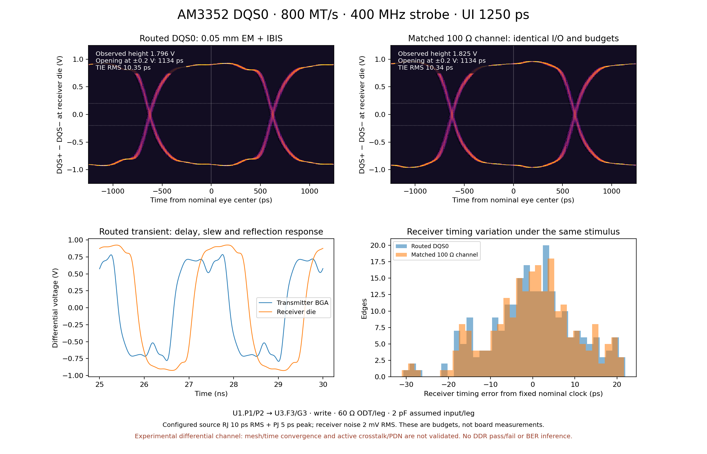
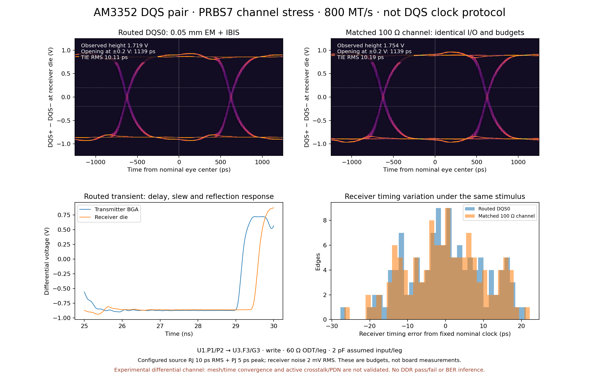
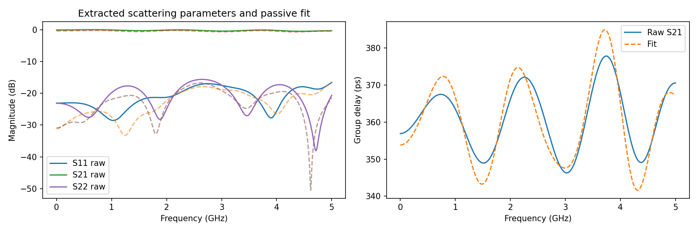
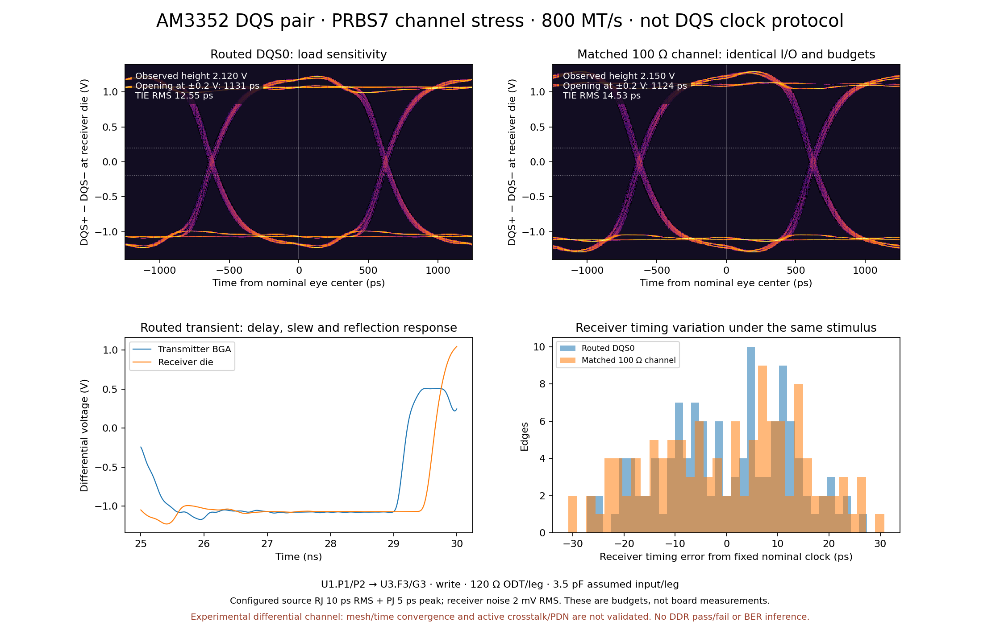
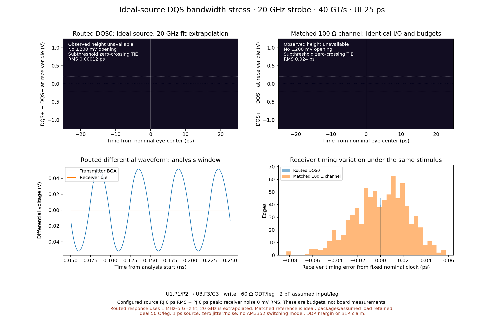

# AM3352 DQS0 routing-derived eye



This is a simulated **write-direction DQS0 interconnect** for pinned
`astra/am3352-sbc` 0.1.19: `U1.P1/P2 → U3.F3/G3`, **800 MT/s, 400 MHz DQS,
1250 ps UI**. The periodic-strobe eye and the separately labeled PRBS7 stress
test use full-board rendered copper and vias, a broadband openEMS differential
two-port extraction, a passive scikit-rf equivalent, and ngspice nonlinear TI
IBIS output models. The matched 100 Ω / 400 ps control uses identical I/O,
package, receiver load, jitter and noise.

The saved eye remains an exploratory result under these assumptions. Device
validation is tracked in the [Winbond validation notes](../../../scripts/si/winbond-validation.md),
and channel convergence remains incomplete. These blockers prevent using the
image or its opening as a credible routing-margin measurement.

For the broadband openEMS channel, the 0.1 → 0.05 mm mesh comparison changes
complex S21 by up to **0.345 below 1 GHz**, and the fine records stop at
**−17.11 / −16.48 dB** energy decay instead of the requested **−50 dB**.
The [mesh comparison](checks/mesh-sensitivity-port1.json),
[fit/passivity report](channel/fit.json) and native logs in `field-port*/`
retain the raw evidence. The separate
[Palace four-port study](https://github.com/tscircuit/circuit-json-to-gmsh/blob/palace-dqs-channel/examples/am3352/palace-channel/README.md)
has complete **400 MHz** diagnostics, but its
[0.6 → 0.4 mm comparison](https://github.com/tscircuit/circuit-json-to-gmsh/blob/palace-dqs-channel/examples/am3352/palace-channel/pad-crop/two-mesh-diagnostic.json)
changes complex S by **0.05804 single-ended / 0.06904 mixed-mode**, versus a
**0.01** criterion. The valid 0.3 mm case has no completed accepted solve under
the recorded **14 GiB** cap. Neither the unconverged broadband result nor a
single clock-frequency sample establishes an accurate transient channel.

## Conditions and captured results

TI model-selection-guide example IOCTRL **0x18B**, `Model_655/847`; board
register settings are unknown. Selected-pin package RLC and mutual inductance
are attached separately. Receiver package values come from Winbond's model;
die input capacitance **2 pF/leg** and ODT **60 Ω/leg to 0.75 V** are assumed.
Jitter is injected in source event timing: **10 ps RMS Gaussian RJ + 5 ps peak
PJ (31 UI period)**. Differential input noise is **2 mV RMS, 500 MHz low-pass**.
These budgets are configured, not measured board properties. Each run uses 256
UI, fixed seeds, a 2 ps maximum ngspice step, and a 20–310 ns analysis window.
Folding removes one mean phase, without independently aligning edges.

| Capture | Eye height (V) | Opening at ±200 mV (ps) | Receiver TIE RMS (ps) |
| --- | ---: | ---: | ---: |
| DQS strobe, routed | 1.796 | 1134.5 | 10.35 |
| DQS strobe, matched reference | 1.825 | 1133.9 | 10.34 |
| PRBS7 stress, routed | 1.719 | 1139.3 | 10.11 |
| PRBS7 stress, matched reference | 1.754 | 1139.2 | 10.19 |

These are finite-capture diagnostics, **not a manufacturer DDR mask, BER
prediction or full-bus pass/fail**. PRBS7 is a channel stress pattern, not DQS
protocol. The independent TI DQ routing-length audit remains applicable.





## Numerical checks and timing

The fine XY cell size is **0.05 mm in the DQS region**, with 2 mm surrounding
margin and a graded grid elsewhere. The declared cell grid is
`[454, 663, 35]`. Both runs use mesh-aligned 0.2 mm differential port
widths and 0.15 mm launch posts. Copper tiling checks complete polygon area
coverage and native-CSXCAD point containment; no side strips are omitted.

Field runs took **46.8 and 47.3 minutes wall time**
including geometry/operator setup. They ran concurrently, with three threads
each, on a five-vCPU AMD EPYC workspace. Requested records are 1.5 ns;
actual probe end times are 1.4949 and
1.4949 ns. This finite-record completion is **not**
the solver's −50 dB energy-decay convergence criterion.

The passive, stable transient fit has per-entry RMS complex S error
**0.02581**, maximum error **0.04226**,
and passivity-enforcement maximum correction
**0.04225**. Raw extraction maximum singular
value is **1.06664**; maximum reciprocity
difference is **0.01577**. Raw spectra are
preserved alongside the corrected equivalent. See `checks/` for sensitivity
comparisons; no formal mesh/time convergence or EM ground-truth claim is made.

Shortening the fine record to 1.25 ns changes transmission by at most
0.0101 in complex S magnitude below 1 GHz. With a separately fitted passive
channel and identical transient budgets, eye opening changes **0.006 ps**,
eye height **7.3 mV**, and mean flight time **6.8 ps**. This is a finite-record
sensitivity check, not proof that unrecorded tails are negligible. Small
routed/reference voltage differences must not be interpreted as physical
copper loss: PEC is lossless and passivity correction also changes amplitude.

Changing the local XY mesh from 0.1 mm to 0.05 mm with the same 1.5 ns
record changes raw S21 group delay at 400 MHz from **422.7 ps to 362.8 ps**.
The maximum complex S21 difference below 1 GHz is **0.345**, largely reflecting
that phase shift. Two resolutions do not establish convergence; absolute
flight time and small waveform differences need further refinement before
using this for routing signoff. This is a source-port-1 spectral comparison,
not a second fully extracted coarse two-port eye.

The longer 0.1 mm source-port-1 run took **13.8 minutes including setup**
for a 3 ns record. Comparing that record with its 1.5 ns prefix changes raw
transmission by up to **0.0294 below 1 GHz**. It also stops above the requested
−50 dB decay criterion. Longer records alone do not resolve mesh uncertainty.

The four DQS0 vias have 13 fine-grid XY nodes within each barrel and their
exported full-board spans are preserved, including the stubs below the inner1
route. The native log also reports **588 unused cylinder primitives**: many
vias outside the DDR region are unresolved by the graded outer grid. Full
copper area coverage is not equivalent to full electrical mesh resolution.
This limitation precludes a validated whole-board EM claim.

An independent same-seed 2 ps → 1 ps ngspice check on the pilot channel changed
zero crossings by at most **0.0097 ps**, validating transient resolution only.
Final ngspice wall times (seconds): `{"clock-routed": 118.2, "clock-reference": 74.1, "prbs-routed": 48.5, "prbs-reference": 29.8}`.

## Reproduce and inspect

Follow [native setup and model instructions](../../../scripts/si). The vendor
IBIS/I–V files are obtained locally and are not redistributed here.

```sh
SI_PYTHON=work/si-python/bin/python SI_NGSPICE=ngspice \
CELL_MM=0.05 FIELD_MAX_NS=1.5 \
bash scripts/generate-em-dqs-eye.sh /path/to/sprm552c.ibs work/em-eye
```

To redraw the saved captures without the licensed vendor files:

```sh
python scripts/si/compare-eyes.py \
  examples/am3352/dqs-em-eye/clock-routed \
  examples/am3352/dqs-em-eye/clock-reference \
  --channel-npz examples/am3352/dqs-em-eye/channel/channel.npz \
  --out work/redraw-dqs-eye --label 'Routed DQS0: 0.05 mm EM + IBIS'
```

Replace `clock-` with `prbs-` to redraw the channel stress capture. Saved
compressed NPZs contain time, transmitter BGA voltages and receiver die
voltages; per-run JSONs contain input/channel hashes, budgets and checks.
`field-port*/` preserves native voltage/current records, spectra, logs and
metadata. `channel/` contains raw Touchstone data and the passive SPICE model.

## Receiver-load sensitivity



A second PRBS7 capture assumes **120 Ω ODT and 3.5 pF per leg**. The routed
height is 2.120 V, opening 1131.2 ps and TIE RMS 12.55 ps; the identically
loaded matched control is 2.150 V, 1123.8 ps and 14.53 ps. Less damping changes
reflections and pattern dependence in both cases; this is not an actual board
ODT configuration or a verified receiver corner.

Rerun the transient with `--mode prbs --odt-ohms 120 --cin-pf 3.5` on
`simulate-dqs-eye.py`, for both routed and `--matched-reference` cases, then
run `compare-eyes.py`. No additional field extraction is required.

## 20 GHz frequency stress



The companion uses a **20 GHz strobe / 40 GT/s / 25 ps UI**. A separate
[400 MHz ideal-source control](frequency-stress/400mhz/eye-comparison.png)
uses the same passive network. Both retain the selected transmitter package,
receiver package, **2 pF/leg** input capacitance and **60 Ω/leg** ODT, with a
routed channel and an identically loaded matched 100 Ω / 400 ps reference.

These captures replace the active IBIS driver with complementary ideal
0–1.5 V test sources, **50 Ω source resistance per leg**, **1 ps rise/fall**,
and **zero jitter and noise** to isolate frequency sensitivity. The original
IBIS snapshots above retain their existing assumptions. Their isolated-edge
converter requires at least 1.22 ns UI; it cannot model repeated 25 ps
transitions. Its guards remain in place, and no vendor edge is compressed.

The extracted spectrum spans **1 MHz–5 GHz**. The 20 GHz fundamental and
harmonics use the rational fit outside that range. Fast ideal-source edges
also contain harmonics above 5 GHz in the 400 MHz control. The selected lumped
package and assumed receiver capacitance contribute attenuation in both
channels. This comparison tests bandwidth sensitivity of the specified
network; eye closure alone does not establish accurate device behavior or
20 GHz routing performance.

| Ideal-source capture | Receiver AC RMS (mV) | Receiver half peak-to-peak (mV) | Opening at ±200 mV (ps) |
| --- | ---: | ---: | ---: |
| 400 MHz, routed | 753.283 | 854.503 | 1219.1 |
| 400 MHz, matched reference | 774.372 | 921.476 | 1219.7 |
| 20 GHz, routed fit extrapolation | 0.02746 | 0.03885 | 0 |
| 20 GHz, matched reference | 0.77275 | 1.09980 | 0 |

AC RMS removes the captured differential DC mean. Peak is half the observed
peak-to-peak span, not the eye height. At 20 GHz every analyzed center fails
the ±200 mV threshold. Mathematical zero-crossing TIE remains available for
these tiny periodic signals; it does not imply a detectable receiver strobe.

The 20 GHz native runs compute **3 µs** of source history and analyze
**2980–3000 ns**. The ideal matched line with these reactive packages has a
natural mode near **20.213 GHz** with about **414 ns** decay time: the earlier
80–100 ns reference contained launch ringing. Independent native AC analysis
predicts a **1.093154 mV** receiver fundamental peak. The late reference's
eight-cycle windows agree within about **0.11%** complex amplitude. This is
a numerical check of the specified ideal network.

Refining the maximum step **0.25 → 0.2 ps** changes receiver AC RMS by
**0.0191% routed / 0.0073% reference**, and half peak-to-peak by
**0.0248% / −0.1464%**. Maximum waveform differences on the same absolute
timestamps are **13.9 nV / 30.3 µV**; small local variation remains in the
high-Q reference. Both threshold openings remain zero. See the
[amplitude/settling audit](frequency-stress/checks/amplitudes-and-routed-timestep.json),
[reference timestep audit](frequency-stress/checks/reference-timestep.json),
and [native AC control](frequency-stress/checks/reference-ac/ac.cir).

The [channel extrapolation audit](frequency-stress/checks/channel-extrapolation.json)
reconstructs the saved fitted S-matrix from its SPICE export within
**2.864e−13**. It predicts S21 **−0.220 dB at 400 MHz / −26.757 dB at 20 GHz**.
The latter is the fitted model's extrapolation, not measured copper loss.

Reproduce these companions without vendor files or another EM extraction:

```sh
SI_NGSPICE=ngspice bash scripts/generate-dqs-frequency-stress.sh \
  examples/am3352/dqs-em-eye/channel/channel.sp work/dqs-frequency-stress
```

The checked PNG and SVG snapshots, compressed waveforms, stimulus events,
native logs and provenance are in `frequency-stress/`. The reproduction command
writes corresponding files to `work/dqs-frequency-stress/`. The 20 GHz simulations
use a **0.25 ps** maximum step; the 400 MHz control uses **0.5 ps**. Analysis
uses the trapezoidal integration method, and windows are recorded per capture.
The adaptive native records contain picovolt voltage differences at
duplicate rounded timestamps after the long reference run. Raw rows are
preserved; provenance records their count and maximum voltage difference.
The plotted linearized samples must remain strictly ordered, cover the full
window and respect the requested sample gap. Closed eyes retain zero threshold opening,
and ambiguous or missing crossings produce unavailable timing metrics with
a reason instead of a fabricated TIE value.

## Scope

PEC thin foils and solid via exteriors omit copper/dielectric loss. Neighboring
copper is present, but neighboring I/O and components are unloaded. The ports
extract balanced differential propagation; common-mode conversion is absent,
and common-mode ODT is projected as a lumped DC load. Receiver transistor
behavior, active DQ/DM aggressors, PDN noise, actual mode registers,
preamble/postamble, turnaround and simultaneous DQ sampling remain unmodeled.
Use this to inspect conditional DQS channel response and compare loading;
do not infer that the entire DDR interface passes.
