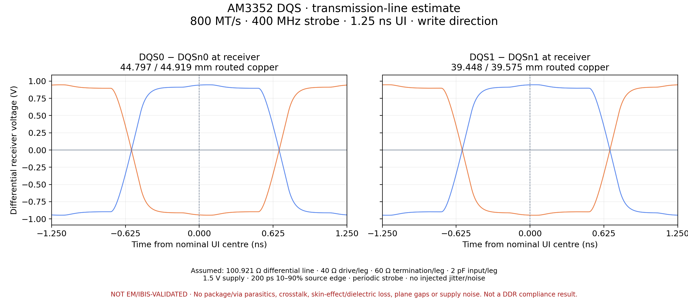

# AM3352 DQS receiver-eye estimate



This is a **route-based transmission-line estimate**, generated by ngspice 44.2
from the public `astra/am3352-sbc` **0.1.19** circuit-json and fabrication stackup.
It is **not an extracted Palace channel, an IBIS simulation or a DDR compliance
result**. The ideal-reference assumption omits the return-plane problems that a
full EM analysis would need to resolve. An open estimated eye does not validate
the board.

The assumed rate is **800 MT/s**, giving a **400 MHz DQS strobe**, **1.25 ns UI**
and a 2.5 ns two-UI plot window. The waveforms represent the write direction at
the memory pins. DQS is driven as complementary periodic strobes, rather than
PRBS data. Fourteen overlapping UI windows follow a 16-UI settling period.
Thin repeated curves reflect the deterministic stimulus: no random jitter or
noise is injected. Preamble, postamble and bus turnaround are excluded.

| Pair | Source → receiver (+ / −) | Routed copper (+ / −) |
| --- | --- | --- |
| DQS0 | U1.P1/P2 → U3.F3/G3 | 44.797 / 44.919 mm |
| DQS1 | U1.L1/L2 → U3.C7/B7 | 39.448 / 39.575 mm |

Horizontal routed copper lengths come directly from circuit-json. Physical
vertical travel between foil centres contributes to estimated delay, but via
inductance, capacitance and unused stubs are omitted. Under the assumed effective
permittivities, mean channel delays are approximately **303.1 ps** and
**285.2 ps**. These are channel-model estimates, not measured or trained delays.
Eye windows use the pair's estimated mean delay; individual edges are not
realigned and no clock-recovery algorithm is applied.

| Electrical assumption | Value |
| --- | --- |
| Complementary source levels | 0 / 1.5 V |
| Driver resistance | 40 Ω per leg |
| Receiver termination | 60 Ω per leg to 0.75 V; 120 Ω differential |
| Receiver input capacitance | 2 pF per leg |
| Source rise/fall time | 200 ps, 10–90%; 250 ps linear ramp |
| Uniform odd-mode impedance | 50.46065 Ω per leg; 100.9213 Ω differential |
| Effective permittivity | 3.0 outer; 4.1 inner; 4.3 vertical travel |
| Reference conductor | Ideal continuous AC reference |
| Copper resistance | DC resistance from widths/thicknesses; uniformly redistributed |

The differential impedance comes from the stackup's **routing target**, not a
field extraction of these routes. The uniform line preserves total estimated
delay and DC resistance. Its ngspice LTRA parameters use `L = Z0/v` and
`C = 1/(Z0*v)`. There is no skin-effect/dielectric loss, package model, crosstalk,
common-mode channel extraction, reference-plane discontinuity, decoupling or
supply-noise model. Drive strength, ODT and slew-rate register values are not
inferred. DQ-to-DQS setup/hold, PVT corners and BER/mask compliance are not checked.

The [assumption/result audit](assumptions-and-results.json) records input hashes,
pin mapping, individual route sections, delay estimates and solver timing.
[Raw transient voltages](waveforms.npz), [netlist](dqs.cir) and
[solver log](ngspice.log) are included. NPZ arrays are `timeSeconds`, `voltages`
and `signalNames`; voltages contain DQS0+, DQS0−, DQS1+, DQS1− receiver signals.

The nominal 2 ps run took **52.95 s** for ngspice, **53.50 s** including plot
generation. A separate 1 ps run took **179.38 s** for ngspice. Comparing settled
differential waveforms gives maximum differences of **18.6 µV** (DQS0) and
**13.5 µV** (DQS1). The [comparison](timestep-comparison.json) includes checksums;
[refined raw results](refined-timestep) are retained. This establishes timestep
stability for the assumed circuit only.

Reproduce from a checkout with Python (`numpy`, `matplotlib`) and ngspice:

```sh
bun scripts/prepare-am3352-example.ts work/am3352
python scripts/generate-dqs-eye.py \
  work/am3352/board.json work/am3352/stackup.json \
  --rate-mts 800 --direction write --lanes 0,1 \
  --source-ohms 40 --termination-ohms 60 \
  --input-cap-pf 2 --rise-time-ps 200 --step-ps 2 \
  --output work/dqs-eye
# Repeat with --step-ps 1 and a separate output directory for refinement.
```

Actual board eyes need a broadband interconnect model and configured IC models.
The [TI AM3352 product page](https://www.ti.com/product/AM3352) supplies the ZCZ
IBIS model; [TI's model-selection guide](https://e2e.ti.com/cfs-file/__key/communityserver-discussions-components-files/791/How-to-use-the-AM335x-IBIS-Models.pdf)
explains DDR pin selections. Winbond lists a W631GG6MB HSPICE model in its
[model documentation](https://www.winbond.com/hq/support/documentation/index.html?__locale=en&category=%2F.categories%2Fresources%2Fspice-model%2F&partNoSearch=).
Vendor models are not used or redistributed here.
