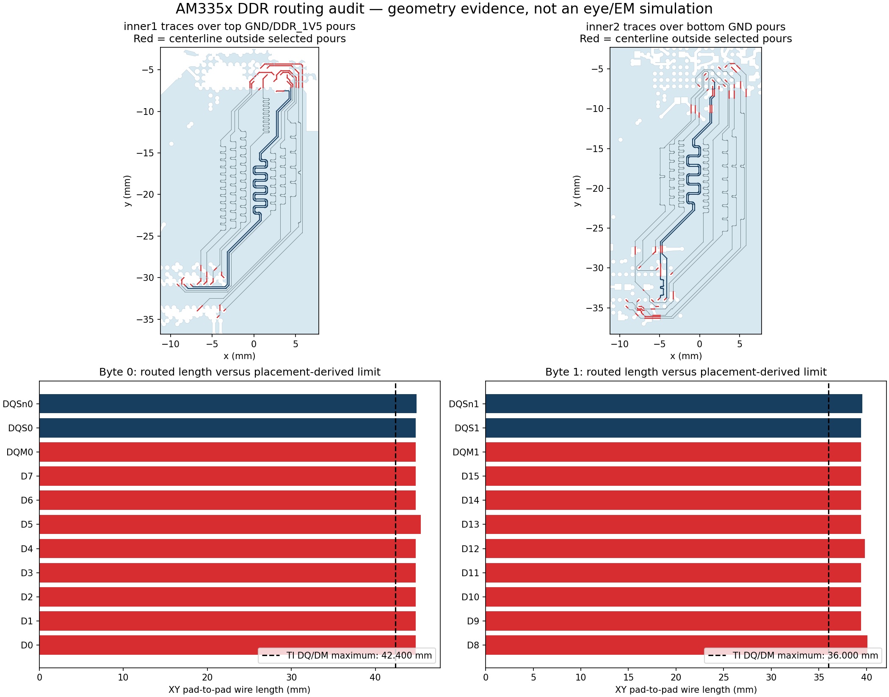

# AM3352 DDR routing quality

This is an independent **geometry audit**, not an EM-derived eye diagram.
Input: `astra/am3352-sbc` release **0.1.19**, ID
`a56db1f7-99bf-4f14-b32e-ab5431f039d0`. Circuit-json SHA256:
`c9d7059fe536865784f175855e0dcc76510972319eec848c18b0ef6dcd2adb40`.
The published board's own DDR audit also reports length failure; these numbers
were independently recomputed from the pinned circuit-json, not copied from it.



| Check | Byte 0 | Byte 1 |
| --- | ---: | ---: |
| Placement-derived DQ/DM maximum (DQLM) | 42.400123 mm | 36.000285 mm |
| Actual DQ/DM lengths | 44.795383–45.430383 mm | 39.447864–40.082864 mm |
| Longest route exceeds limit by | 3.030260 mm | 4.082579 mm |
| DQ/DM/DQS maximum spread | 0.635 mm | 0.635 mm |
| DQS pair length skew | 0.122265 mm | 0.127 mm |

[TI SPRS717L, Table 7-69, pages 187–188](https://www.ti.com/lit/ds/symlink/am3352.pdf)
defines DQLM from the longest pad-to-pad Manhattan distance in each DQ byte,
allows 25 mil (0.635 mm) DQ/DQS length matching, and 5 mil (0.127 mm) pair skew.
Both bytes fail the absolute DQ/DM length limit. Matching passes at the allowed
spread; this leaves no geometric spread allowance for additional routing.
The DQS pair in byte 1 is also at its pair-skew limit. These are XY copper
lengths, excluding vertical and package flight times. No inter-byte matching
requirement is imposed.

The blue background is the selected rendered reference pour; white retains its
real voids. The dark traces are DQS, grey traces are DQ/DM, and red portions lie
outside that pour's centerline projection. For inner1, selected top pours are
GND and DDR_1V5; for inner2, selected bottom pours are GND. Exact polygon/line
intersections measure uncovered DQS lengths of 1.154/1.191 mm on inner1 and
4.631/3.060 mm on inner2. This ignores nearby pads/traces and other layers and
does not prove a missing AC return path. Inspect those areas, real stitching and
decoupling before treating either reference as a continuous ideal plane.

The audit does **not** calculate impedance or crosstalk. The previous eye model's
100.921 Ω uniform differential impedance was a fabrication target, not an
extraction from these actual traces. Tight meanders and reference changes need
coupled geometry in the channel model. An open eye with that target substituted
cannot override the routing failures or establish a DDR timing margin.

## Reproduce

From the repository checkout, with Python `numpy`, `matplotlib`, `shapely`:

```sh
bun scripts/prepare-am3352-example.ts work/am3352
python scripts/audit-am335x-ddr.py work/am3352/board.json \
  --reference inner1:top:GND,DDR_1V5 \
  --reference inner2:bottom:GND --output work/ddr-routing
```

The preparation script pins/downloads the board and prepares a separate 1 MHz
return-current case. This audit reads only its board JSON; it does not run that
case or interpret 1 MHz as the DDR clock.

## Model availability and remaining work

A [conditional DQS0 EM/ngspice eye](../dqs-em-eye) now runs end to end. It uses
openEMS differential extraction, a compatible local TI isolated-edge conversion,
selected package parasitics and an explicit linear receiver load. Source jitter
and receiver noise are configured scenario budgets. This is a routing-dependent
interconnect check; the full-bus and exact-receiver requirements below remain.


Primary vendor sources were checked. Files are kept locally and not redistributed:

| Model | Status |
| --- | --- |
| [TI AM335x ZCZ IBIS Rev C](https://www.ti.com/lit/zip/SPRM552) | Available. `sprm552c.ibs` SHA256 `23011a68eb8ff35562615b5b108edcb9f017c5e61f4f68e32f35c5fb88f163be`. KiCad 9.0.2 rejects its original coupled package matrix. The new adapter disables that section in a local compatibility copy, converts isolated switching edges and attaches selected pin R/L/C plus mutual inductance separately. It checks exported switching sources before using them. |
| [TI model-selection guide](https://e2e.ti.com/cfs-file/__key/communityserver-discussions-components-files/791/How-to-use-the-AM335x-IBIS-Models.pdf) | Maps IOCTRL settings to models. Its **example** 0x18B setting uses DQS Model_655, DQS# Model_847 and DQ Model_352 for writes; Model_1002/496 for receiving DQS/DQ. These are not verified board register settings. TI explicitly directs timing assessment to the data-manual rules. |
| [Exact Winbond W631GG6MB HSPICE model](https://www.winbond.com/resource-files/w631gg6mb_hspice.zip) | Downloaded successfully. SHA256 `a033f6b9d7f8ff7ba50625b3c3cd5128f48bbe4345223c5a3bfa72555a15eaed`. Its transistor models and device netlist use `.PROT freelib` encryption; ngspice cannot run them. HSPICE is not available in this environment. No different Winbond die is substituted. |
| Actual broadband board channel | A balanced DQS0 two-port now runs with openEMS. Full-bus multiport extraction, active aggressors and mesh/time convergence are not established by that conditional example. Prior full-board Palace meshing still failed. |
| DDR settings and jitter budget | Actual registers and measured jitter/noise are not provided. The new eye explicitly assumes 800 MT/s and declares its source jitter/noise budgets; it does not infer them from the board. |

For complete DDR routing compliance, obtain a compatible exact I/O/package model
and simulator, extract a converged broadband coupled channel with real signal,
ground and power-reference paths, then simulate both read/write directions and
drive/ODT/PVT corners with DQ aggressors and declared source jitter/noise.
Check mesh and domain convergence, passivity/reciprocity, broadband coverage and
transient timestep stability. Preserve common versus independent jitter across
DQ/DQS; arbitrary independent noise can misrepresent a source-synchronous bus.
Apply device-specific receiver timing masks and expected bits for compliance.

`scripts/analyze-ddr-waveforms.py` can already analyze those simulator or measured
waveforms: density eyes, receiver/transmitter TIE, added channel edge variation,
and per-DQ voltage/time validity relative to actual DQS sampling edges. It
retains jitter and rejects ambiguous/missing crossings. The seven analytic
waveform regressions use known input timing and are explicitly synthetic tests,
not results for this board. Circuit geometry tests generate their input through
TSX/core, including a reference-pour void and a length failure with passing skew.

The new workflow provides a conditional DQS interconnect eye. Complete DDR
signoff still needs the model, multiport and validation requirements above.
This report does not mark the board fabrication ready.
