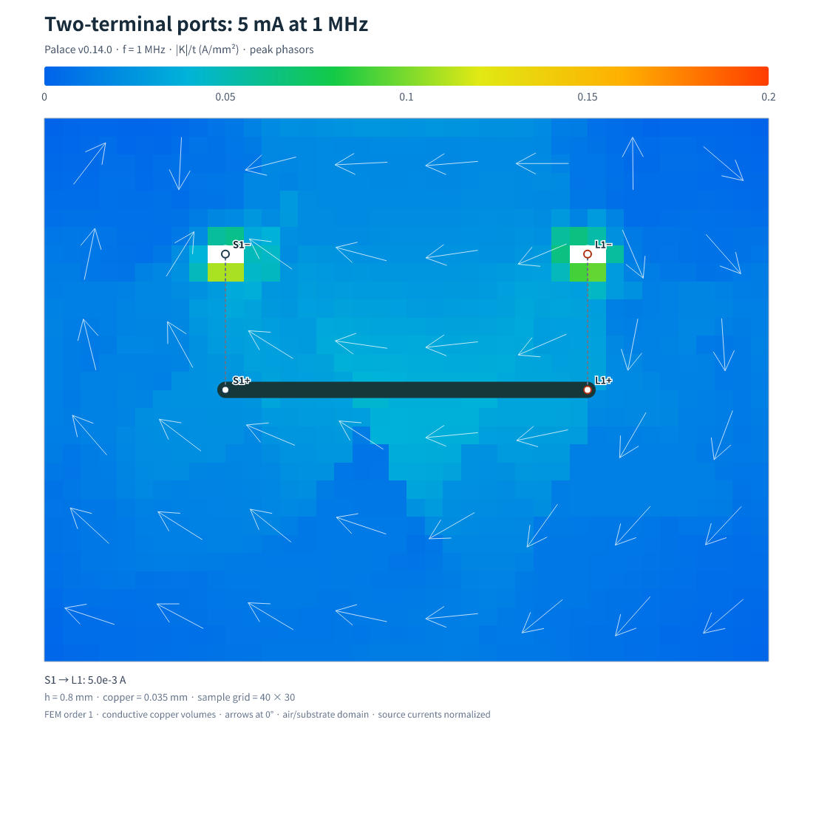

# Explicit source and load terminal pairs



Geometry comes from [ExplicitPortBoard.tsx](../../../tests/fixtures/ExplicitPortBoard.tsx):
an 8 × 6 mm, two-layer board, 0.8 mm substrate, one 0.18 mm top signal,
and bottom ground. `U1.OUT` → `U2.IN` is driven at **5 mA peak, 1 MHz**.
Source reference is `U1.GND`, load reference `U2.GND`; each rectangular
0.8 mm ground pad has a concentric 0.2 mm drill / 0.6 mm outer-diameter ground
via. Copper and barrel plating are 0.035 mm. Source/load resistances are
25 Ω / 100 Ω. Top-to-ground ports span the actual pad gaps.

The built Node CLI ran the complete mesh, Palace v0.14.0 solve, 0.05 mm sampling
and SVG/PNG export in **56.64 seconds** on the shared execution environment
(two MPI processes). This is a smoke benchmark, not a hardware-independent
performance guarantee. See `run-timing.json`. The original sample grid was
160 × 120, with 19,176 copper samples after drill exclusions. FEM order 1,
mesh target 2 mm and air padding 2 mm; this is **not a mesh-converged reference**.

The checked-in `reference.json` was resampled from the same solved fields at
0.2 mm to keep this example small. Its provenance records hashes of the original
circuit, model and mesh. Raw volume fields are not checked in. Source/load CSVs,
configuration, solver log, mesh summary and both timing reports are included.

The example image uses a **0.2 A/mm²** color-scale maximum through
`renderPalaceModelSvg`; the CLI's fixed default is 50 A/mm². Colors are complex
magnitude of thickness-averaged ground conduction current. Dashed lines connect
signal (`+`) and reference (`−`) markers. These signs indicate port polarity,
not independent DC voltage sources.

To reproduce from a checkout with the required Python environment and Docker:

```sh
bun -e 'import { Circuit } from "@tscircuit/core"; import { ExplicitPortBoard } from "./tests/fixtures/ExplicitPortBoard"; const c = new Circuit(); c.add(ExplicitPortBoard({})); await c.renderUntilSettled(); await Bun.write("work/explicit-board.json", JSON.stringify(c.getCircuitJson()));'
bun run build
node dist/cli.js work/explicit-board.json \
  --source U1.OUT --source-reference U1.GND \
  --load U2.IN --load-reference U2.GND --ground GND \
  --current 5mA --frequency-hz 1000000 \
  --source-impedance 25ohm --load-impedance 100ohm \
  --mesh-size 2 --order 1 --air-padding 2 --processes 2 \
  --cell-size 0.05 --output work/explicit-case
```

Use `--python /path/to/venv/bin/python` if needed. The tests regenerate the circuit
from TSX, check the terminal coordinates/resistances against this Palace evidence,
and snapshot the render; the dedicated mesh workflow also constructs both top
and offset bottom reference geometries with Gmsh.
